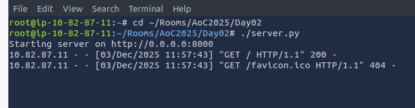
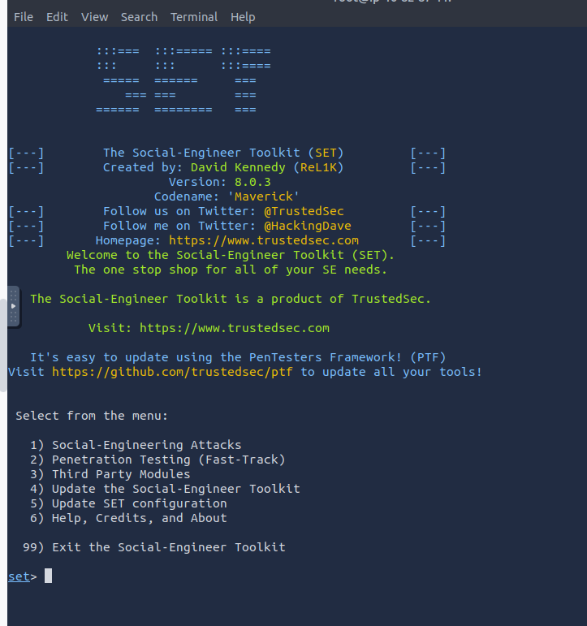
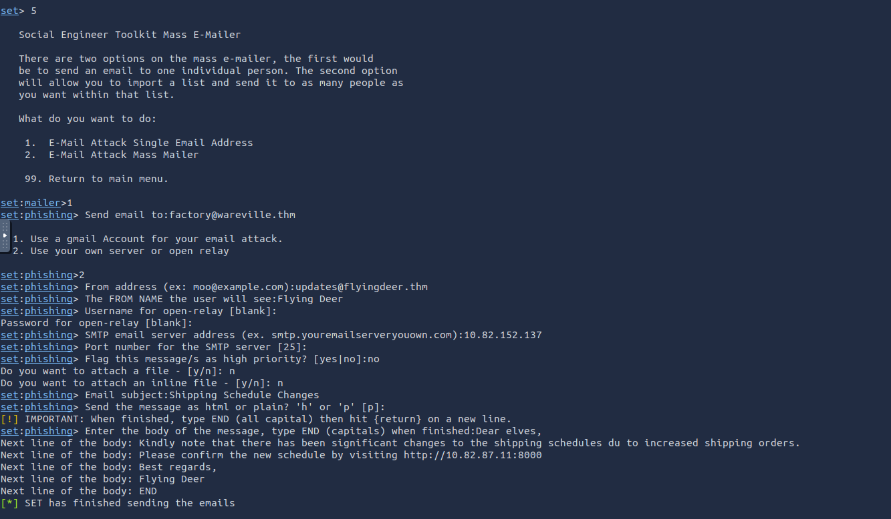
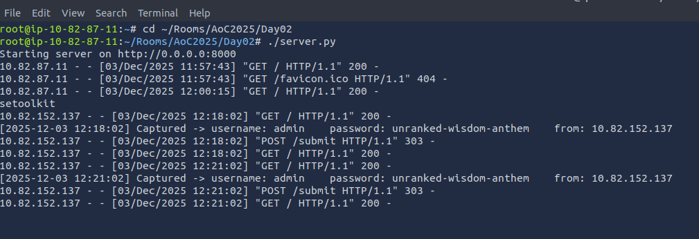
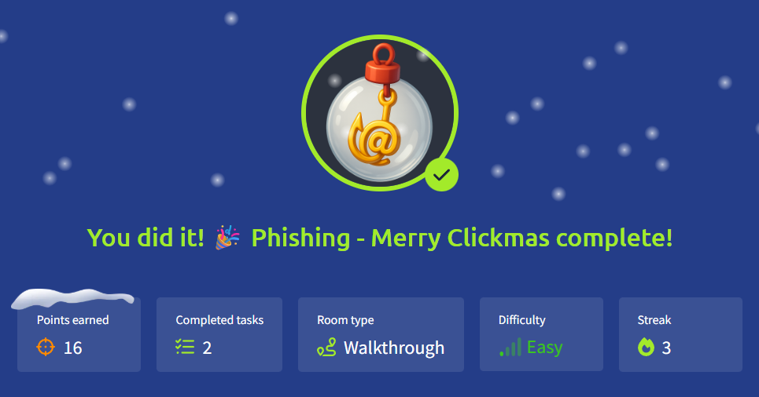

# 🎄Advent of Cyber 2025 – Day 02🎄
### **Phishing - Merry Clickmas** 🎣
---

## 🎯 Objective 

Today's challenge introduced me to the basics of phishing and how it fits into social engineering. I explored how attackers create convincing phishing emails and how a fake login page can be used to capture a user's credentials.
Using the Social-Engineer Toolkit (SET) was completely new to me, so this exercise helped me understand how attackers build and send phishing emails step-by-step. It also showed me how surprisingly easy it can be to set up a fake login page and collect whatever information a user enters.
Overall, this challenge helped me see how phishing works in practice and why it remains such a common and effective attack method when users aren’t careful.

---

## 🛠 Tools & Techniques Used

- Social-Engineer Toolkit (SET)

- Social Engineering Attacks

- Mass Mailer Attack

- Python server for hosting fake login page
(server.py)

- Phishing fundamentals (sender spoofing, malicious links)

- Social engineering psychology

- Terminal usage inside the AttackBox

---

## 🧠 What I Learned Today

- How phishing relies on psychological manipulation (urgency, authority, curiosity).

- How SET can generate convincingly spoofed emails.

- How attackers host fake login portals to capture credentials.

- The difference between single-target and mass phishing campaigns.

- How SMTP relay servers affect email delivery.

- How small mistakes in emails (poor grammar, suspicious links) can be red flags.

- Why security awareness programs need to continuously train employees.

---

## 📌 Step-by-Step Summary

**1.** Reviewed the basics of social engineering and phishing attack vectors.

**2.** Launched the provided phishing web server using:
   ```
   ./server.py
   ```
   This hosted a fake TBFC login page that records credentials.
**3.** Opened SET using:
   ```
   setoolkit
   ```
**4.** Navigated through SET menus:

- Option 1 → Social-Engineering Attacks
- Option 5 → Mass Mailer Attack
- Option 1 → Single Email Address Attack

**5.** Configured the phishing email:

- Target: `factory@wareville.thm`
- Sender name: “Flying Deer” (trusted shipping company)
- Email address spoof: `updates@flyingdeer.thm`
- SMTP relay server: 10.82.152.137
- Subject: “Shipping Schedule Changes”
- Message included a link to the fake login page
  ```
  http://10.82.87.11:8000
  ```
**6.** Sent the phishing email using SET.

**7.** Observed the terminal running `server.py` for any captured credentials.

**8.** Concluded that at least one user entered their login details — demonstrating how effective phishing can be if security awareness is low.
  
---

## 🔐 Key Cybersecurity Concepts

#### Social Engineering:
Manipulating users into performing actions such as clicking links or revealing sensitive information.

#### Phishing:
Deceptive emails/messages crafted to make the victim take an action that benefits the attacker.

#### Spoofing:
Forging sender fields in emails to appear legitimate.

#### Fake Login Pages:
Common attack technique where targets unknowingly enter credentials into attacker-controlled sites.

#### Credential Harvesting:
Capturing usernames/passwords from victims who interact with malicious pages.

---

## 🖼️ Screenshots

 

*Launching the fake login page using `server.py`* 




*Navigating Social-Engineer Toolkit options*


*Entering spoofed sender name, relay server, and email content.*


*The fake login page successfully captures submitted credentials.*


*The phishing message appears in the target user's inbox.*



*Proof of completing Day 02.*

---

## ✅ Final Takeaway

Day 2 demonstrated how simple it is for attackers to launch effective phishing campaigns using open-source tools like SET. Even a basic spoofed email can compromise an entire organization if employees are not trained to recognize red flags.
