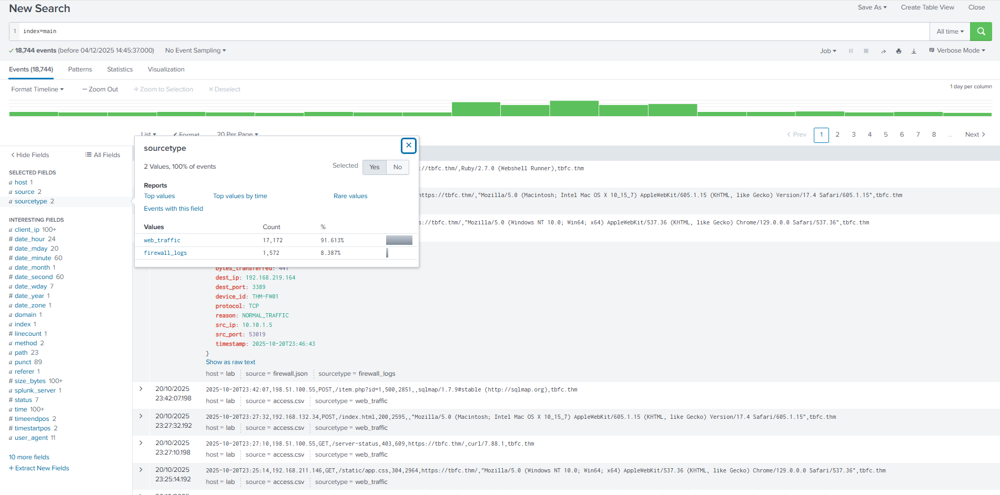
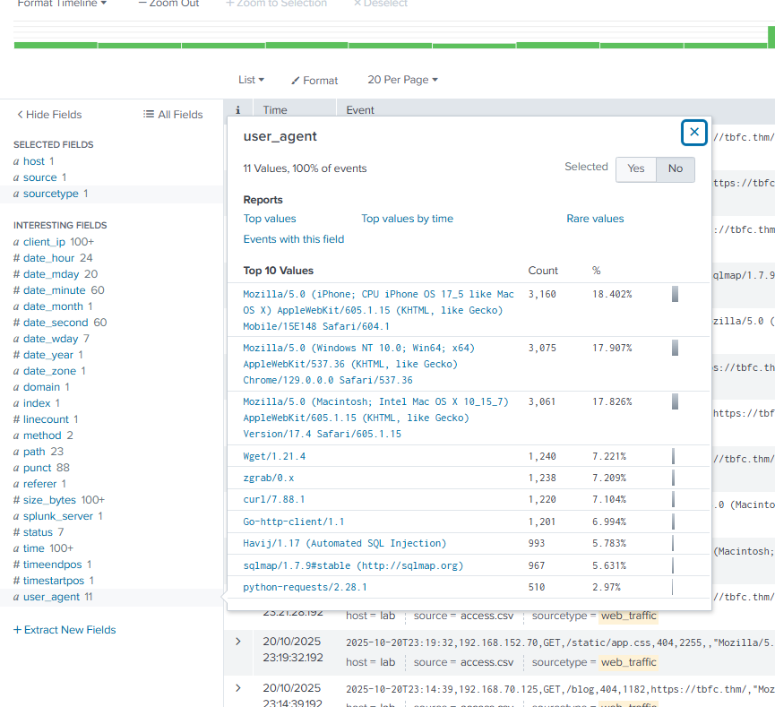
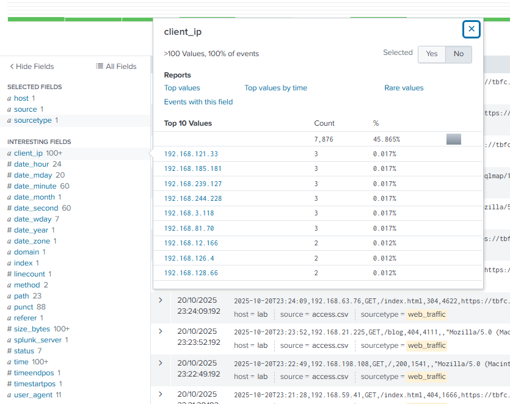
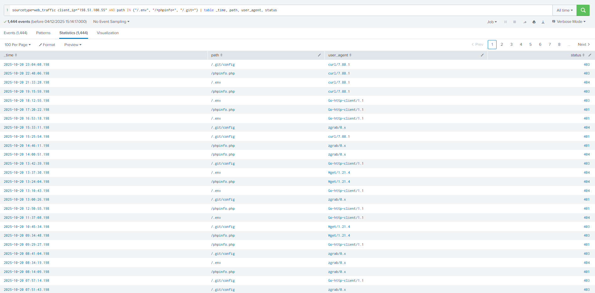
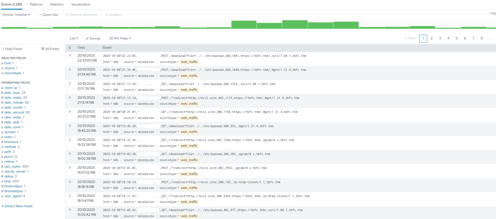
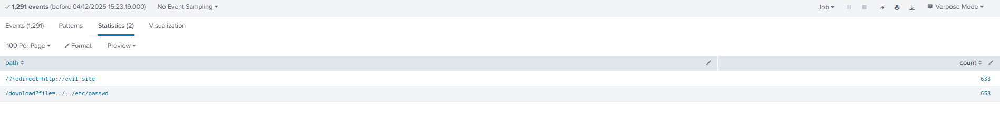
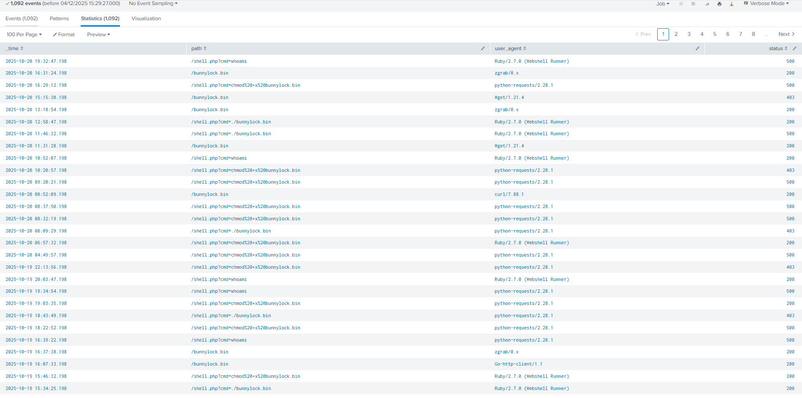
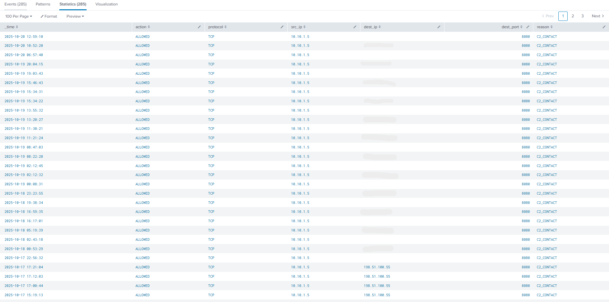
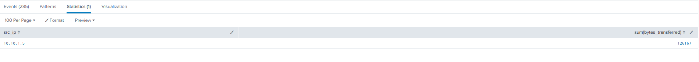
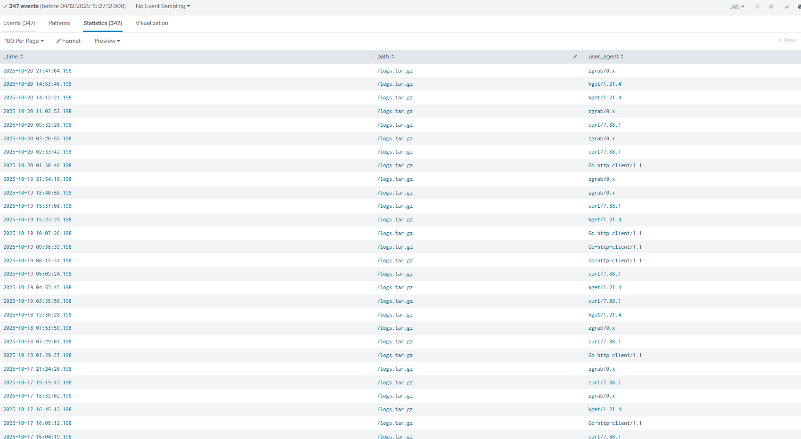

# 🎄Advent of Cyber 2025 – Day 03🎄
### Splunk Basics - Did you SIEM?

---

## 🎯 Objective 

The goal of today’s challenge was to learn how to use Splunk to investigate malicious activity by analyzing web server logs and firewall logs.
From a learner’s perspective, this exercise was all about understanding how SIEM tools help uncover an attacker's entire activity just from log data.

---

## 🛠 Tools & Techniques Used

- Splunk Enterprise (Search & Reporting)
- Log search queries (`index, sourcetype, stats, timechart`)
- Filtering and analyzing suspicious fields such as
  - `user_agent`
  - `client_ip`
  - `path`
  - `status`
- Attack reconstruction techniques:
  - Reconnaissance detection
  - Path traversal detection
  - SQL injection identification
  - Data exfiltration analysis
  - C2 (Command & Control) communication tracing

---

## 🧠 What I Learned Today

- How to navigate Splunk and work with indexed log data.
- How to spot anomalies by looking at spikes in activity.
- How attackers leave patterns behind, even when using automated tools.
- How to progressively filter out normal traffic to isolate malicious events.
- How to reconstruct an entire attack chain using SIEM queries.
- Why SIEM platforms are essential for security analysts and SOC teams.

---

## 📌 Step-by-Step Summary

1. Exploring logs in Splunk
   - Searched `index=main` to reveal available logs.
   - Identified two key datasets: `web_traffic` and `firewall_logs`.

2. Finding abnormal activity
   - Switched to All Time and visualized spikes in log volume.
   - Large peaks pointed to potential attack windows.

3. Investigating suspicious user agents
   - Detected tools like `curl`, `wget`, `sqlmap`, and custom scripts.
   - These clearly stood out from normal browsers.

4. Isolating malicious traffic
   - Filtered out normal browser traffic using:
     ```
     user_agent!=*Mozilla* user_agent!=*Chrome* user_agent!=*Safari* user_agent!=*Firefox*
     ```
   - This highlighted one IP responsible for the malicious activity.

5. Reconstructing the attacker’s actions
    - Footprinting: Looked for `.env`, `.git`, and config files.
    - Path Traversal: Requests containing `../../` stood out.
    - SQL Injection: Payloads like `SLEEP(5)` confirmed exploitation.
    - Exfiltration: Attempts to download `backup.zip` and `logs.tar.gz`.
    - RCE & Ransomware Execution: Identified `/shell.php?cmd=./bunnylock.bin`.
  
6. Firewall Correlation
    - Observed outbound C2 communication from the compromised server.
    - Confirmed using fields like `reason=C2_CONTACT`.

---

## 🔐 Key Cybersecurity Concepts

- SIEM (Security Information & Event Management)
- Anomaly detection
- Threat hunting using log correlations
- Reconnaissance, exploitation, and exfiltration phases
- Command & Control (C2) communication
- Importance of log visibility during investigations

---

## 🖼️ Screenshots

 
*Initial Log Overview – sourcetype identification* ⬆️




*Suspicious User Agents Identified* ⬆️



*Attacker IP Identified* ⬆️


*Reconnaissance Queries – probing sensitive paths* ⬆️



*Enumeration & Exploitation Evidence* ⬆️


*Ransomware Staging & Webshell Execution* ⬆️


*Firewall C2 Communication Confirmation* ⬆️



*Data Exfiltration Confirmed* ⬆️

---

## ✅ Final Takeaway

Today’s challenge helped me understand how much information can be uncovered simply by analyzing logs. Splunk made it possible to trace the attacker’s full journey—from recon and exploitation to exfiltration and C2 activity. As a learner, this exercise showed me how SIEM tools empower security analysts to detect threats that would otherwise remain hidden.
