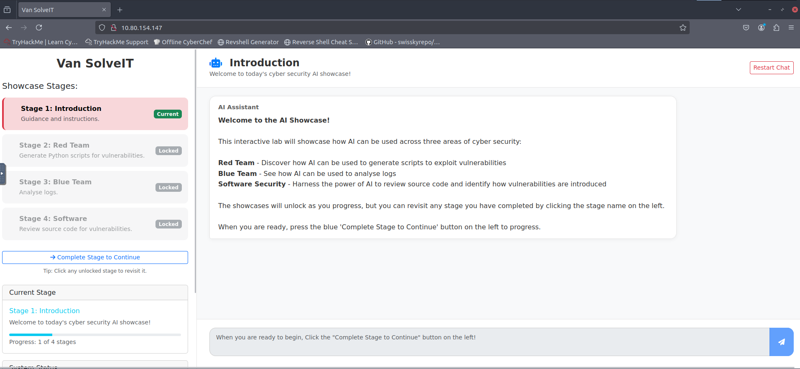
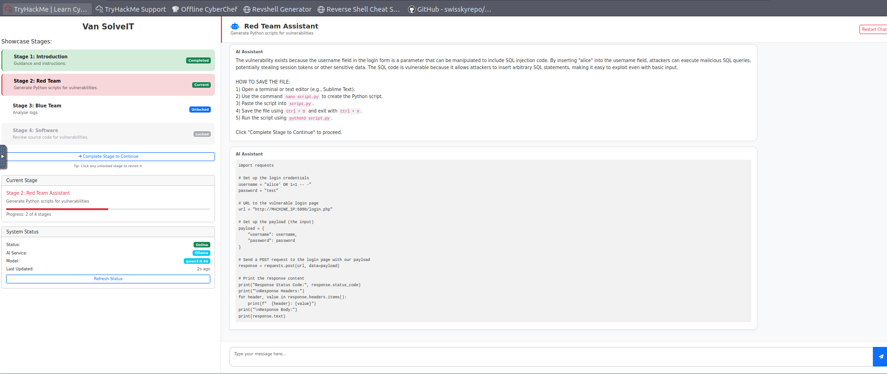
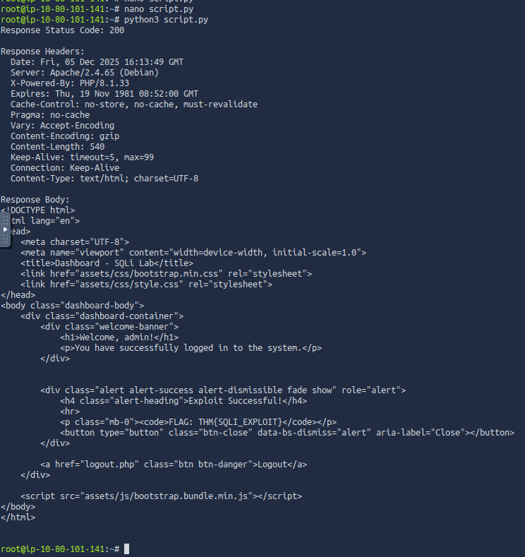
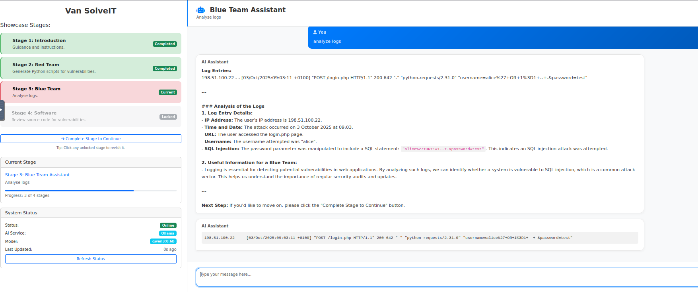
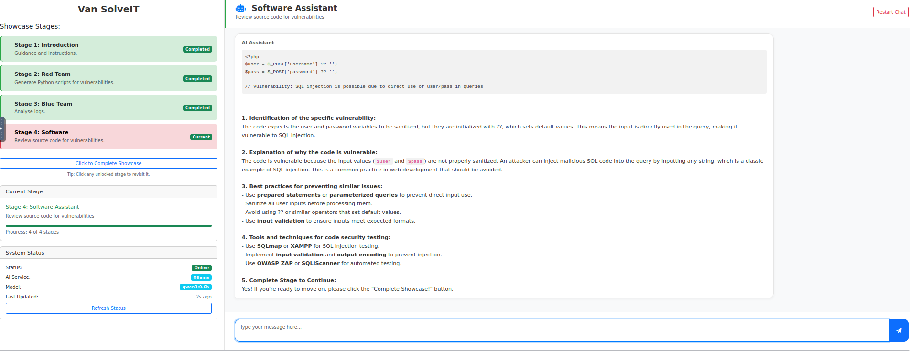
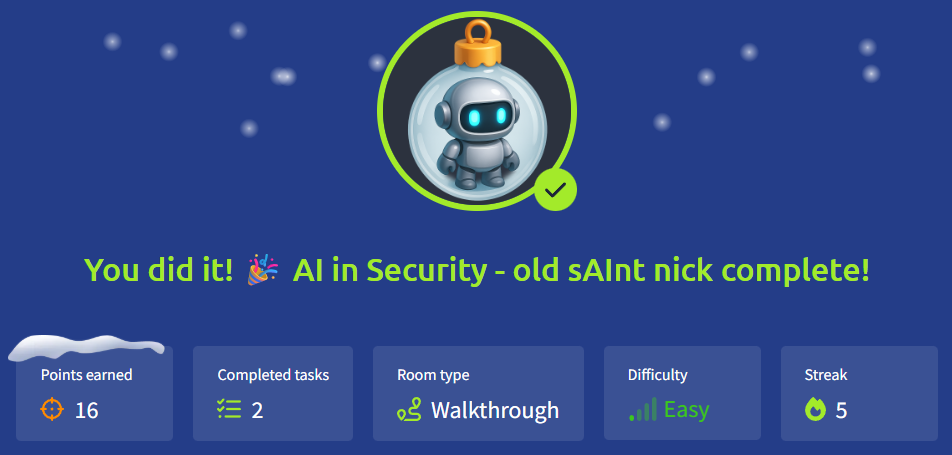

# 🎄Advent of Cyber 2025 – Day 04🎄
### 🤖 AI in Security - old sAInt nick
---

## 🎯 Objective 

Explore how artificial intelligence is used across cyber security — including defensive tools, offensive automation, log analysis, and software security — and understand the risks, benefits, and practical use cases of AI-powered systems.

---

## 🛠 Tools & Techniques Used

- AI-powered analysis (conceptual, no hands-on tools used)
- Security automation examples (defensive + offensive)
- Practical walkthrough guided by Van SolveIT, an AI-based assistant
- Concepts related to SAST/DAST, anomaly detection, behavioural analysis, and exploit generation

---

## 🧠 What I Learned Today

Today’s room focused on how AI fits into modern cyber security workflows — not as magic, but as a powerful accelerator for both defenders and attackers.

Some of todays learnings:
  - AI helps defenders process huge volumes of logs, network data, and telemetry faster than humans.
  - AI can assist with real-time detection, triage, and response — including isolating devices or blocking suspicious actions.
  - Offensive roles also use AI for reconnaissance, payload creation, and parsing noisy output from tools.
  - In software, AI contributes to automated code review, SAST/DAST scanning, and identifying vulnerabilities.
  - AI is not perfect — outputs must be verified, and over-reliance introduces risk (false positives, hallucinations, misuse).
  - Human oversight remains essential, especially when AI is involved in security decisions or automated actions.

---

## 📌 Step-by-Step Summary

**1.** Read the intro to understand how AI can be used in different parts of cybersecurity (defensive, offensive, and software security).

**2.** Looked at a table that mapped simple AI features (like data processing and behaviour analysis) to real security use-cases.

**3.** Went through defensive examples where AI helps with log triage, anomaly detection, and alert enrichment in SIEM/EDR tools.

**4.** Reviewed offensive examples where AI supports recon, OSINT, and parsing scan/enumeration results.

**5.** Saw how AI can act as a helper for code security (SAST/DAST), pointing out possible vulnerabilities in source code.

**6.** Studied the risks of using AI in security: wrong answers, over-reliance, privacy concerns, and why humans still need to double-check results.

**7.** Used the Van SolveIT lab to try three AI “showcases” (Red, Blue, Software) and experienced how an AI assistant can guide an investigation in real time.
  
---

## 🔐 Key Cybersecurity Concepts

- #### AI-assisted Detection & Response
  I saw how AI can quickly sift through logs, connect events, and surface suspicious activity way faster than I could manually.

- #### Behavioural Analysis
  I learned how AI can spot behaviour that doesn’t fit the “normal” pattern, which helped me understand anomaly-based detection better.

- #### Automated Reconnaissance
  AI helped parse OSINT/scan results and highlight the important bits, which is really useful when you’re still learning what to focus on.

- #### SAST/DAST AI Integration
  I got a first look at how AI can review code and running apps for vulnerabilities, acting like an extra security reviewer.

- #### AI Risk Management

  I realised AI isn’t magic – it can be wrong, biased, or noisy, so its output always needs to be double-checked.

- #### Human-in-the-Loop Security
  The main lesson: AI is a helper, not a replacement. Human judgement is still central in security work and other parts of the tech industry.

---

## 🖼️ Screenshots

*AI showcase introduction* ⬆️

*Stage 2: Red Team (AI-generated exploit script)* ⬆️

*the script.py has been run* ⬆️

*Stage 3: Blue Team (AI log analysis)* ⬆️

*Stage 4: Software (AI code review / SAST-style output)* ⬆️

*Proof of completing Day 4*. ⬆️

---

## ✅ Final Takeaway

Today’s challenge helped me understand how AI is transforming cyber security across defensive, offensive, and development workflows. AI is powerful but requires structure, validation, and skilled oversight.

