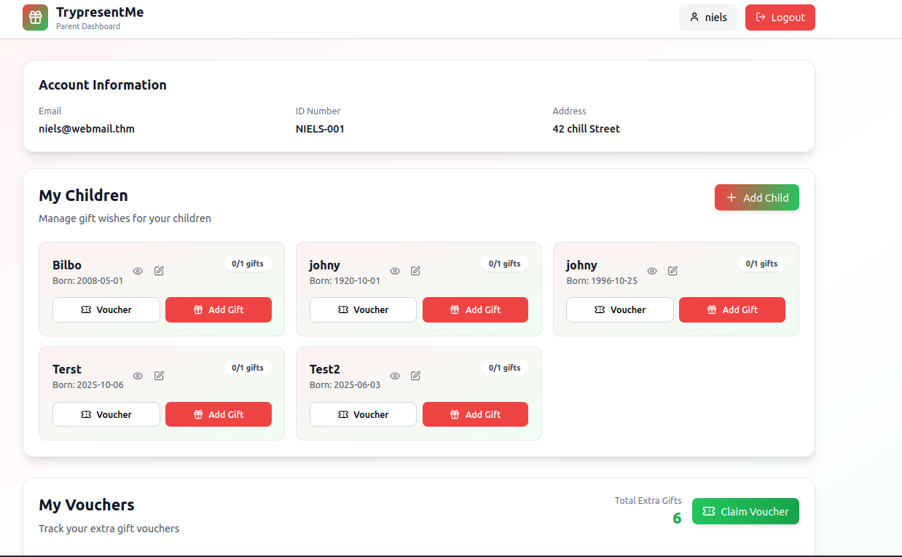
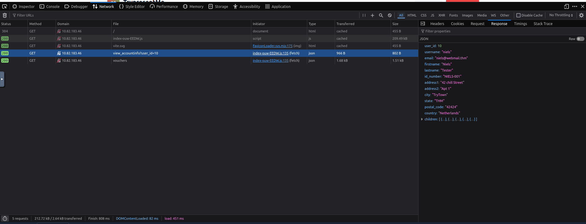
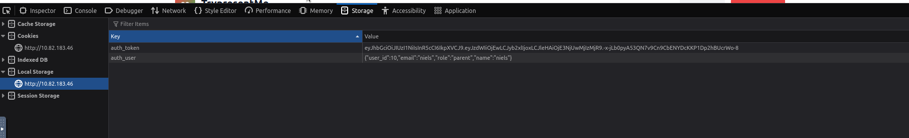

# 🎄Advent of Cyber 2025 – Day 05🎄
### IDOR - Santa’s Little IDOR 

---

## 🎯 Objective 

Today’s challenge focused on understanding IDOR (Insecure Direct Object Reference) — a common and dangerous web vulnerability that occurs when applications trust user-supplied IDs without confirming who is requesting the data.
The goal was to identify where IDOR existed in the TrypresentMe app and exploit it responsibly.

---

## 🛠 Tools & Techniques Used

- Browser DevTools → Network tab
- Inspecting API requests
- Editing Local Storage values
- Observing parameter changes (e.g., user_id=)
- Base64 decoding / hash identification
- UUID analysis

---

## 🧠 What I Learned Today

- What IDOR is and why it appears so often in web apps
- How user IDs and object references can leak sensitive data
- How to observe background API requests to spot vulnerable endpoints
- How encoded or hashed values (Base64, MD5, UUID) still aren’t secure if predictable
- Why proper authorization checks are the only real fix
- How to approach IDOR with a testing mindset — change input → observe → confirm

---

## 📌 Step-by-Step Summary

- Started by reviewing what IDOR means and how insecure references lead to unauthorized access.
- Logged into the TrypresentMe dashboard and opened DevTools → Network to observe API calls.
- Noticed that the request view_accountinfo?user_id=10 revealed that the app trusted the ID we sent.
- Changed the user_id value manually — and immediately saw another user's data (successful IDOR).
- Edited Local Storage to modify the stored auth_user value and confirmed privilege switching.
- Explored other IDOR formats:
- Base64-encoded IDs
- Hashed IDs
- UUID-based identifiers
- Learned that even “hidden” or “random-looking” values can still be predictable and abused.
- Reviewed good security design: enforce permission checks, avoid guessable IDs, monitor suspicious activity.
  
---

## 🔐 Key Cybersecurity Concepts

- IDOR (Insecure Direct Object Reference)
- Authorization vs Authentication
- Horizontal privilege escalation
- Predictable identifiers
- Weak access control
- Secure design for user-driven applications

---

## 🖼️ Screenshots

*Main Dashboard After Login* ⬆️

*Network Tab Showing the Vulnerable Numeric ID Request* ⬆️

*Response Tab Showing Personal Data From user_id=10*

*Local Storage showing editable auth_user and user_id values*

---

## ✅ Final Takeaway

This challenge helped me understand how even small mistakes in permission checks can accidentally expose private user data.
I also learned that it doesn’t matter if an ID looks “hidden” or complicated — if the server never checks who is asking for the data, an IDOR will still happen.
From a beginner’s perspective, the attack process was surprisingly simple:
just change something → see what happens → and if it works, you suddenly have access you shouldn’t have.
It really showed me how easy IDOR can be to find, and why proper access checks are so important.
