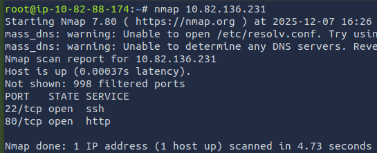
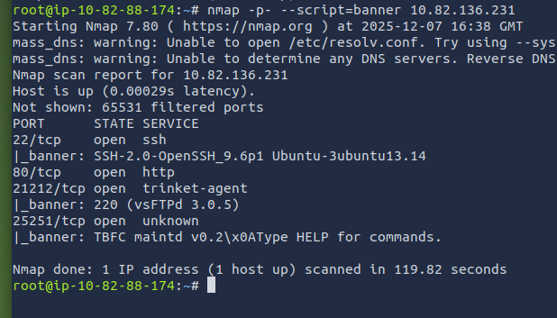
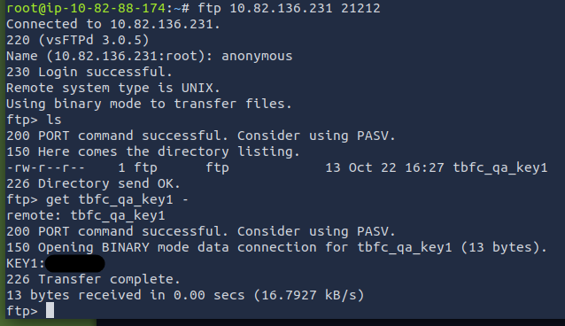
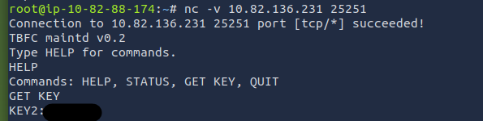
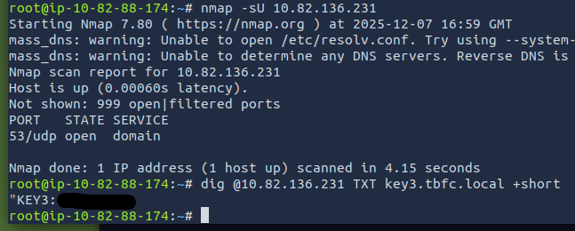
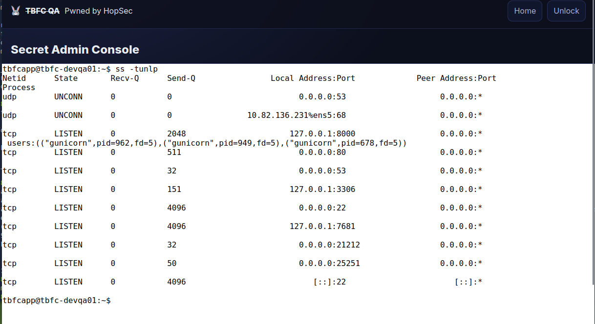

# 🎄Advent of Cyber 2025 – Day 07🎄
### Network Discovery - Scan-ta Clause

---

## 🎯 Objective 

Learn how to identify exposed network services using scanning tools, enumerate hidden ports, interact with discovered services, and ultimately retrieve hidden keys and access the QA server.

---

## 🛠 Tools & Techniques Used

- Nmap (basic scans, full port scan, service detection, banner grabbing)
- FTP Client (anonymous login, file retrieval)
- Netcat (nc) (manual interaction with unknown/custom services)
- dig (querying DNS servers for TXT records)
- ss / netstat (listing listening ports on the host itself)
- MySQL CLI (basic database inspection)

---

## 🧠 What I Learned Today

Today I learned how powerful port scanning is for discovering hidden services. Even when a system only shows a couple open ports at first, scanning the full range can reveal unexpected services like custom apps, FTP on non-standard ports, or DNS running on odd UDP ports. I also learned how to manually interact with services using FTP or Netcat to pull secret data, and how to enumerate listening ports from inside a host to uncover additional services like MySQL.

---

## 📌 Step-by-Step Summary

- Ran an initial Nmap scan and found SSH + HTTP.
- Performed a full port scan, revealing FTP on a custom port and a custom TBFC service.
- Connected to FTP and retrieved the first hidden key.
- Used Netcat to interact with the custom service and collected the second key.
- Conducted a UDP scan and discovered DNS on port 53 → queried TXT records to get the third key.
- Logged into the QA server’s admin console using all three combined keys.
- Listed internal listening ports using ss/netstat, revealing MySQL.
- Queried the MySQL DB to recover the final flag.
  
---

## 🔐 Key Cybersecurity Concepts

- Port Scanning reveals services that may not be obvious publicly.
- Non-standard ports don’t hide services—they just require deeper scanning.
- Service enumeration via FTP, Netcat, or banner grabbing provides valuable insight.
- UDP scanning can expose DNS, SNMP, and other important protocols.
- On-host enumeration (ss/netstat) gives visibility that external scans may not.
- Least privilege & segmentation help reduce exposure of unnecessary services.

---

## 🖼️ Screenshots

*This scan shows the first two open ports (22 and 80), giving us an initial overview of the target.* ⬆️

*The full scan reveals hidden services on ports 21212 (FTP) and 25251 (TBFC service).* ⬆️

*Using FTP on port 21212, I connected anonymously and downloaded the first key.* ⬆️

*By interacting with the TBFC service on port 25251 via Netcat, I extracted the second key.* ⬆️

*A DNS TXT lookup returned the third hidden key from the server.* ⬆️

*Inside the target, I listed open ports to confirm active services such as MySQL.* ⬆️

*Proof of completing Day 7.* ⬆️

---

## ✅ Final Takeaway

Full port scanning and service enumeration reveal far more than a basic scan ever will — attackers rely on this, and defenders must know how to spot exposed, forgotten, or misconfigured services
