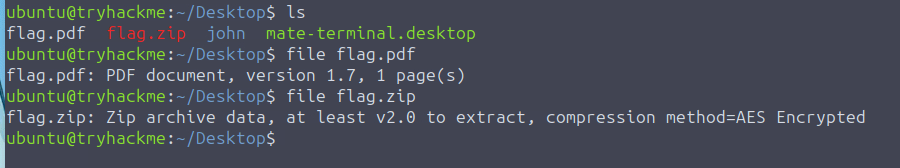
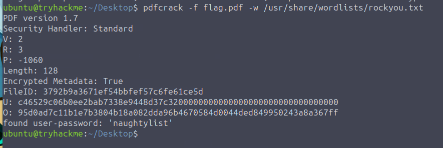
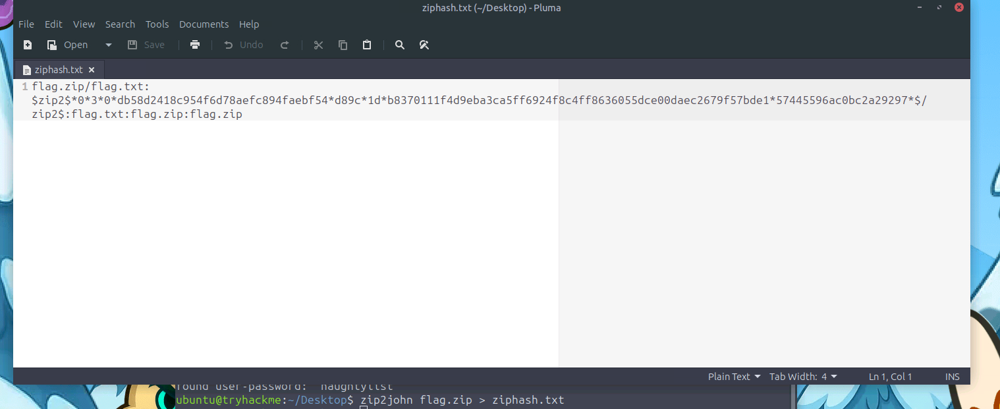

# 🎄Advent of Cyber 2025 – Day 09🎄
### Passwords - A Cracking Christmas

---

## 🎯 Objective 

Understand how attackers recover weak passwords that protect encrypted files (PDFs, ZIPs) using dictionary and mask attacks — and how defenders can detect password-cracking activity through process monitoring and telemetry.

---

## 🛠 Tools & Techniques Used

- file – Determine file types.
- pdfcrack – Recover passwords from encrypted PDFs.
- zip2john + john – Extract ZIP hashes and crack them.
- Wordlists such as rockyou.txt.
- Detection tools (Sysmon, auditd) and Sigma rules.

---

## 🧠 What I Learned Today

- Attackers don’t “break” encryption — they guess weak passwords.
- Dictionary attacks are fast because many users reuse predictable passwords.
- Mask attacks narrow the search space to make brute force more efficient.
- Tools like john, pdfcrack, and hashcat automate password recovery.
- Password cracking leaves a trail of indicators (process names, arguments, GPU usage).
- Blue teams detect cracking attempts by monitoring behavior, not by seeing the password itself.

---

## 📌 Step-by-Step Summary

- Used `file` to check whether provided samples were PDF or ZIP.
- Ran a dictionary attack against the PDF using `pdfcrack` + `rockyou.txt`.
- For the ZIP file, created a hash using `zip2john`, then cracked it with `john`.
- Reviewed common cracking telemetry: process creation, GPU load, command-line flags, etc.
- Learned how defenders write detection rules (Sysmon, auditd, Sigma).
  
---

## 🔐 Key Cybersecurity Concepts

- Weak passwords, not encryption, are the usual weakness.
- Dictionary attacks: fast, effective, and the #1 attacker method (A dictionary attack is when a attacker uses a predefined list of potential passwords).
- Mask attacks: targeted brute force based on known patterns.
- Password cracking is noisy — defenders can detect it by:
    - Monitoring tools like `john`, `pdfcrack`, `zip2john`
    - Watching for flags like `--wordlist`, `--mask`
    - High GPU usage (common with hashcat)
    - Repeated file reads of encrypted samples or wordlists

---

## 🖼️ Screenshots

*Using the file command to determine whether the sample is a PDF or a ZIP.*

*Running* `pdfcrack` *with* `rockyou.txt` *to attempt password recovery on the PDF file.*

*Using* `zip2john` *to convert the ZIP file into a crackable hash for John the Ripper.*

*John successfully cracks the ZIP password using the wordlist.*

---

## ✅ Final Takeaway

Weak passwords make encrypted files easy targets — and cracking leaves clear evidence for defenders who know what to look for.
