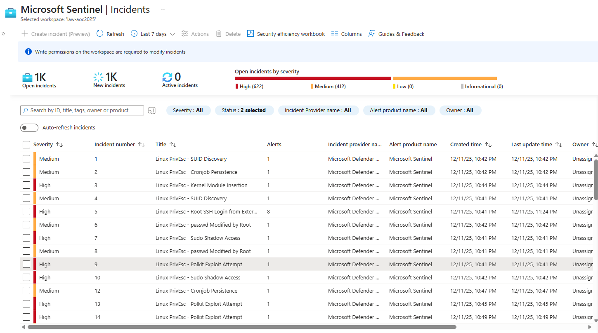
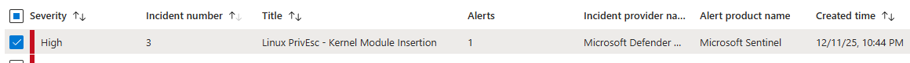
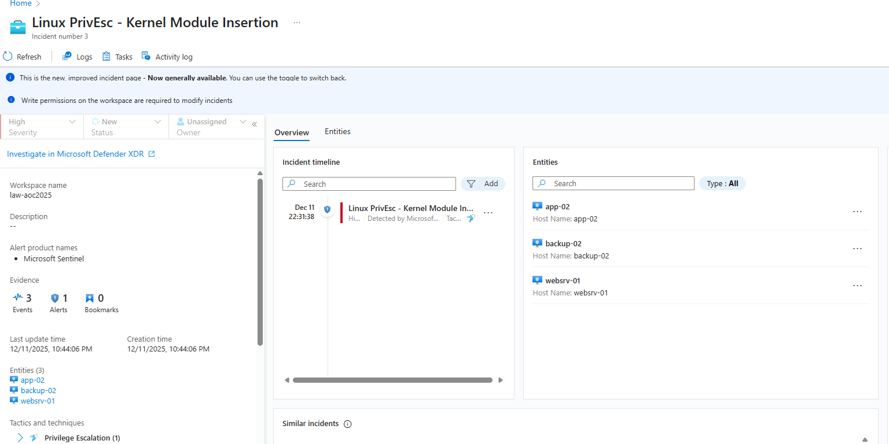
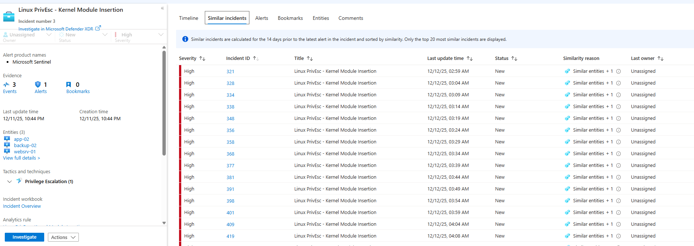
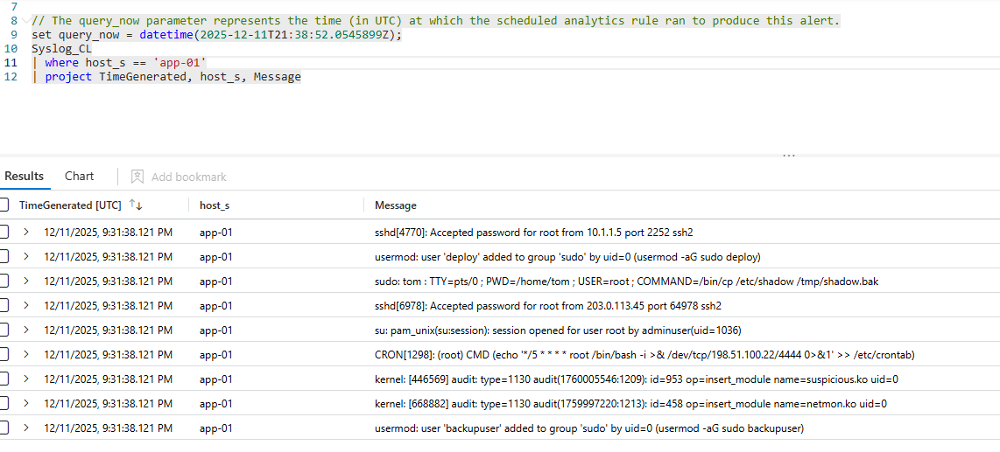
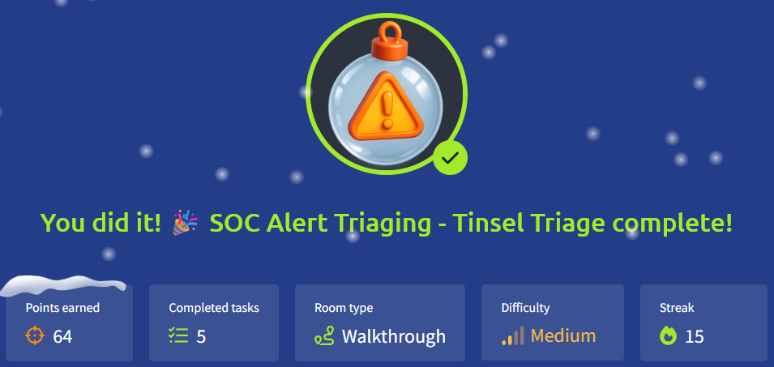

# 🎄Advent of Cyber 2025 – Day 10🎄
### SOC Alert Triaging - Tinsel Triage

## Having problems connecting to the cloud server that is required for day 10s assignment, will try to do it another day! 

---

## 🎯 Objective 

Learn how SOC analysts investigate and triage security alerts using Microsoft Sentinel, focusing on severity, context, timelines, related alerts, and deeper log analysis.

---

## 🛠 Tools & Techniques Used

- Microsoft Sentinel (Incidents, Logs, Analytics Rules)
- Azure Portal
- Kusto Query Language (KQL)
- Alert correlation & triage methodology
- Timeline reconstruction and event analysis

---

## 🧠 What I Learned Today

- How alert triage helps analysts prioritize what actually matters.
- The four triage dimensions: Severity, Time, Context, Impact.
- How to investigate an alert by checking entities, evidence, and timelines.
- How to correlate multiple alerts belonging to the same user/host.
- How to switch from simple mode → KQL mode for deeper log analysis.
- How to identify privilege-escalation behavior from raw logs (kernel module insertion, account changes, shadow file backups, SSH activity).

---

## 📌 Step-by-Step Summary

- Reviewed alert triaging concepts and the importance of prioritization.
- Loaded the Sentinel environment and validated that logs were ingested.
- Enabled Analytics Rules to trigger simulated incidents.
- Opened Sentinel Incidents and focused on high-severity Linux PrivEsc alerts.
- Investigated one incident in detail: evidence, entities, creation time, status.
- Checked the full alert timeline and correlated related alerts.
- Switched to KQL mode and ran queries on Syslog_CL to uncover underlying attacker actions.
- Identified events including kernel module insertion, shadow backups, user modifications, and root SSH activity.
  
---

## 🔐 Key Cybersecurity Concepts

- Alert Triage – filtering noise so only meaningful alerts get attention.
- Correlation – connecting multiple alerts across the same host or user.
- Privilege Escalation Indicators – kernel module installation, SUID changes, account modifications.
- KQL Investigation – transforming raw logs into actionable insights.
- Incident Lifecycle – initial access → discovery → escalation → persistence.

---

## 🖼️ Screenshots

 
*Microsoft Sentinel incidents dashboard showing multiple Linux privilege escalation alerts across hosts.* ⬆️

*High-severity “Linux PrivEsc – Kernel Module Insertion” incident selected for investigation.* ⬆️

*Incident overview showing affected hosts and initial detection timeline for kernel module insertion.* ⬆️

*Similar incidents view revealing repeated kernel module insertion activity across multiple alerts.* ⬆️

*KQL query and results confirming malicious activity, including kernel module insertion, root access, and privilege escalation.* ⬆️

*Proof of completing Day 10.* ⬆️

---

## ✅ Final Takeaway

This challenge showed how SOC analysts move from surface-level alerts to a deeper understanding of attacker behavior using Sentinel’s incident view, correlation features, and KQL log analysis. A great real-world example of blue-team investigation workflow.
