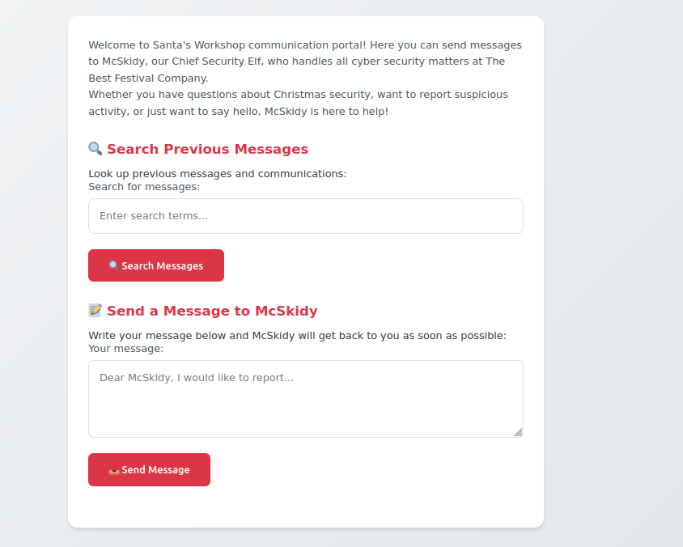
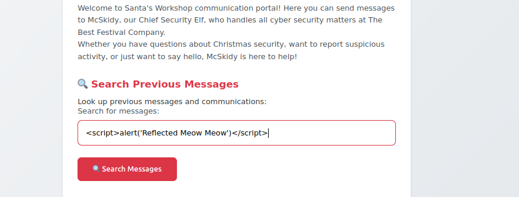
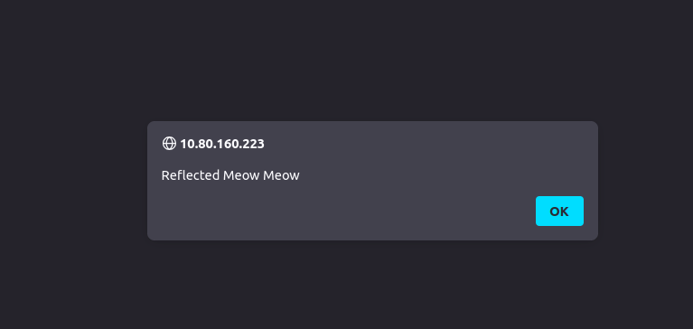
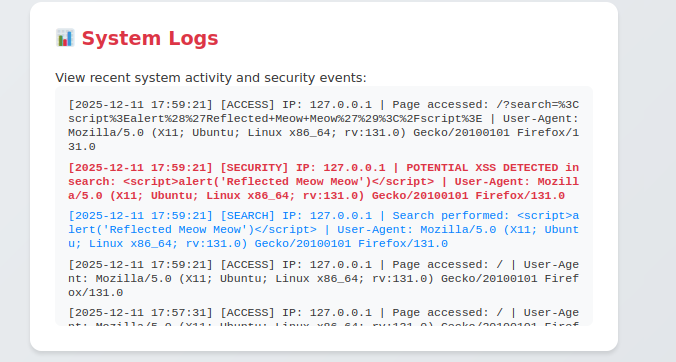
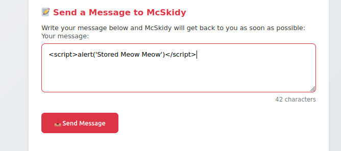
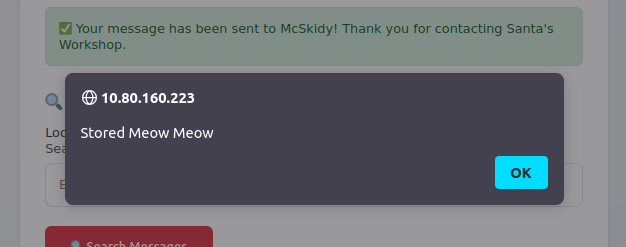
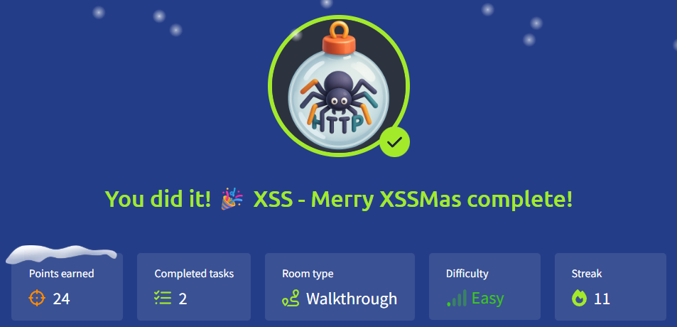

# 🎄Advent of Cyber 2025 – Day 11🎄
### XSS - Merry XSSMas 

---

## 🎯 Objective 

Learn how Cross-Site Scripting (XSS) works, identify reflected and stored XSS vulnerabilities, and understand how attackers can manipulate web applications using client-side script injections.

---

## 🛠 Tools & Techniques Used

- Web browser (AttackBox)
- HTML/JavaScript payloads
- XSS testing techniques
- System log inspection

---

## 🧠 What I Learned Today

- The difference between reflected and stored XSS
- How user input can be interpreted as JavaScript when not sanitized
- How XSS payloads appear inside system logs
- Why proper encoding/output handling is critical

---

## 📌 Step-by-Step Summary

- Opened the web app and identified the search input as a potential injection point.
- Injected a reflected XSS payload to confirm code execution.
- Observed the alert popup confirming reflected XSS.
- Navigated to System Logs to verify that the unfiltered input appeared in server logs.
- Submitted a stored XSS payload through the message form.
- Reloaded the page and confirmed that the script executed persistently.
  
---

## 🔐 Key Cybersecurity Concepts

**Reflected XSS**
  - Executes immediately through a crafted link or user action.
  - Common in search bars and URL parameters.

**Stored XSS**
  - Script is saved on the server and runs for every visitor.
  - More severe — can lead to account takeover or credential theft.

**Why XSS Matters**
  - Steal session cookies
  - Inject fake content or deface pages
  - Redirect users or perform unwanted actions

**How to Prevent It**
  - Sanitize and encode input/output
  - Avoid using innerHTML
  - Use secure cookie attributes
  - Validate and escape all user-controlled data

---

## 🖼️ Screenshots

*Shows the main page of the application and the search input where the XSS tests begin.* ⬆️

*Screenshot of the XSS payload typed into the search field before execution.* ⬆️

*Browser alert box appearing after submitting the payload — confirms reflected XSS worked.* ⬆️

*Log entry revealing that unfiltered user input is being stored and displayed in system logs.* ⬆️

*Screenshot of the malicious script typed into the message/comment form before sending.* ⬆️

*Screenshot of the alert popup automatically appearing on page load — proves persistent (stored) XSS.* ️️⬆️

*Proof of completing Day 11.* ⬆️

---

## ✅ Final Takeaway

XSS happens when a website doesn’t properly filter or encode user input. Even small scripts can run in the browser and cause things like cookie theft or fake content. This showed me how important it is to sanitize input and handle user data safely.
