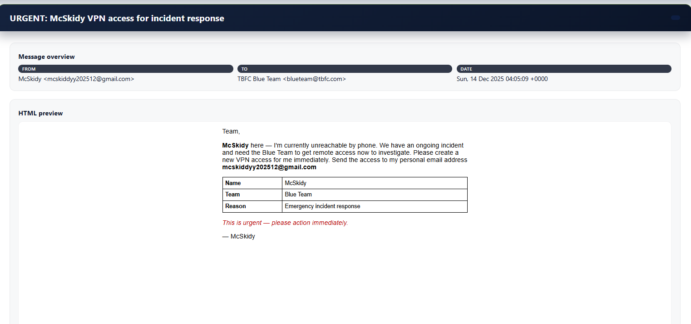
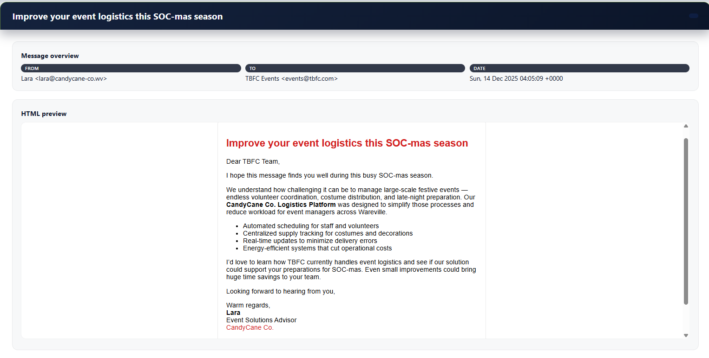
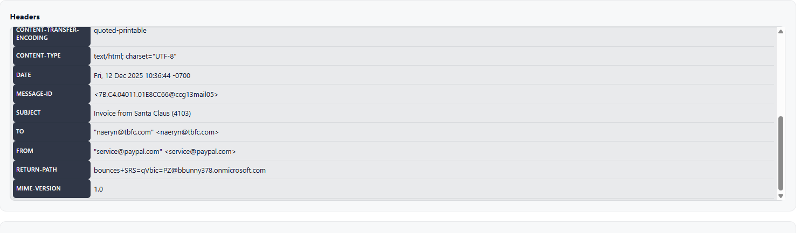
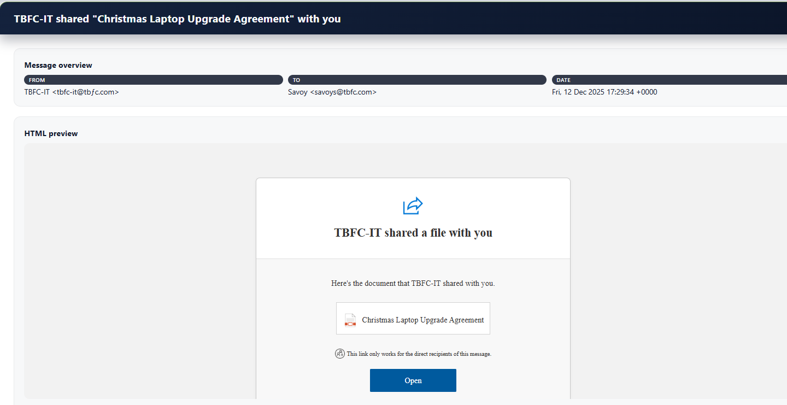
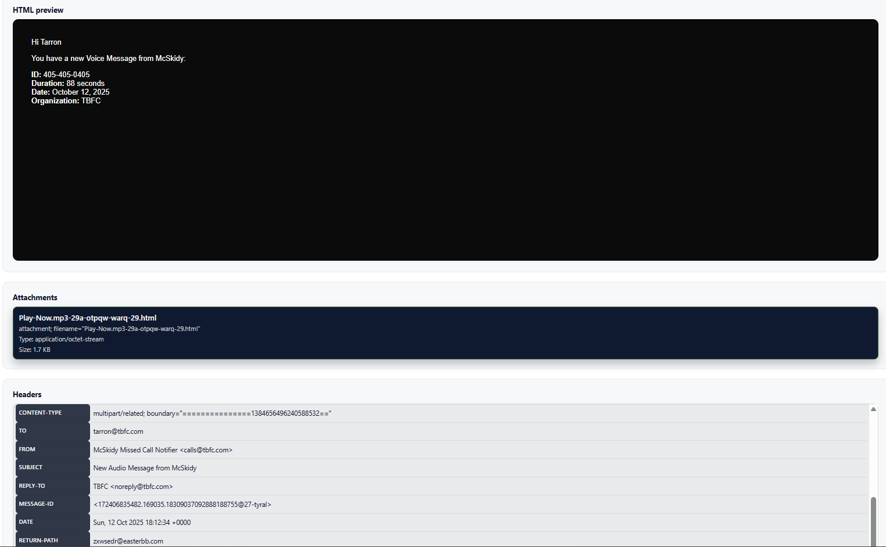
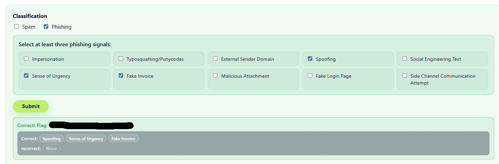
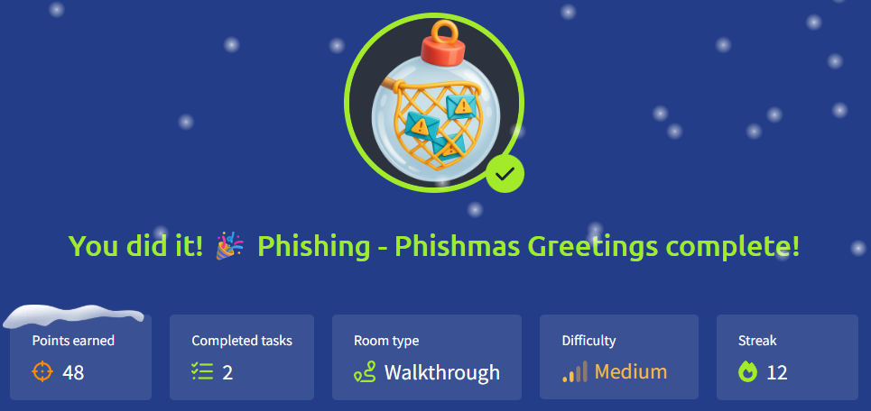

# 🎄Advent of Cyber 2025 – Day 12🎄
### Phishing - Phishmas Greetings

---

## 🎯 Objective 

The goal of today’s lab was to learn how to identify and triage phishing emails by analyzing real-world examples.
I focused on spotting common phishing techniques such as impersonation, social engineering, spoofing, and malicious attachments.

---

## 🛠 Tools & Techniques Used

- Email analysis interface (TryHackMe lab)
- Header inspection (From, Return-Path, Authentication-Results)
- Visual inspection of HTML email content
- Domain analysis (free domains, typosquatting, punycode)
- Logical triage: phishing vs spam

---

## 🧠 What I Learned Today

- Phishing is more about manipulating people than exploiting technical vulnerabilities.
- Not all suspicious emails are phishing — understanding intent matters.
- Free email domains, urgency, and impersonation are strong warning signs.
- Email headers often reveal what the visible sender tries to hide.
- Attackers increasingly use legitimate services (OneDrive, Google Docs) to bypass filters.

---

## 📌 Step-by-Step Summary

**1.** Reviewed multiple email examples and classified them as spam or phishing.
**2.** Identified impersonation attempts using free or fake domains.
**3.** Analyzed social engineering tactics such as urgency and authority.
**4.** Inspected email headers to detect spoofing attempts.
**5.** Identified typosquatting and punycode domain abuse.
**6.** Analyzed malicious attachments and fake login pages.
**7.** Selected phishing indicators to successfully triage each email.
  
---

## 🔐 Key Cybersecurity Concepts

**Phishing vs Spam**
  - Spam is mostly annoying and untargeted.
  - Phishing aims to steal credentials, money, or access.

**Social Engineering**
  - Uses urgency, trust, fear, or authority to pressure users.
  - Often combined with impersonation of trusted people or teams.

**Impersonation**
  - Attackers pretend to be employees, IT staff, or vendors.
  - Often paired with free email domains or fake sender names.

**Spoofing**
  - Email looks legitimate, but headers reveal failed SPF/DKIM/DMARC checks.
  - Return-Path often exposes the real sender.

**Typosquatting & Punycode**
  - Domains designed to look almost identical to real ones.
  - Exploits users’ lack of attention to detail.

**Malicious Attachments & Fake Login Pages**
  - HTML files and fake portals are used to steal credentials.
  - Often disguised as invoices, agreements, or voice messages.

---

## 🖼️ Screenshots

*Shows a phishing email where the sender impersonates an internal user while using a free or external email domain.* ⬆️

*Used as a comparison example to show the difference between spam and phishing.* ⬆️

*Highlights urgent language and social engineering techniques used to pressure the recipient.* ⬆️

*The Return-Path reveals the email was sent from a different domain than claimed, confirming sender spoofing.* ⬆️

*Shows a domain designed to look legitimate through misspellings or punycode usage.* ⬆️

*Demonstrates how phishing emails deliver malicious HTML attachments* ⬆️

*Confirms correct phishing indicators were identified and selected during triage.* ⬆️

*Proof of completing Day 12.* ⬆️

---

## ✅ Final Takeaway

Phishing is effective because it targets human behavior, not systems.
By slowing down, checking sender details and understanding attackers intentions, it becomes much easier to spot well-crafted phishing attempts.
