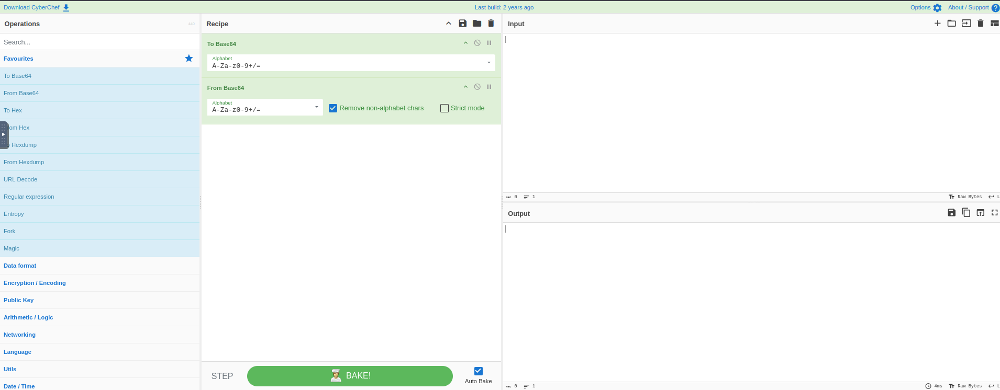
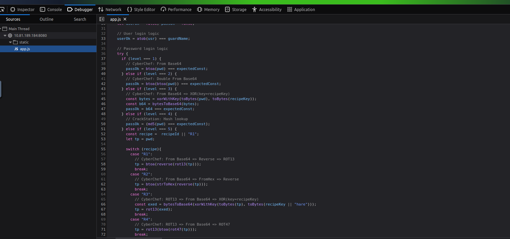
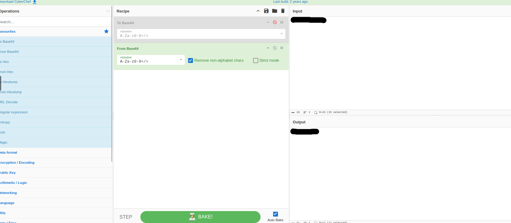
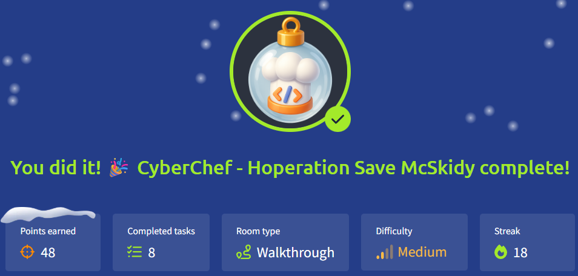

# 🎄Advent of Cyber 2025 – Day 17🎄
### CyberChef - Hoperation Save McSkidy

---

## 🎯 Objective 

The objective of Day 17 was to analyze a web-based challenge where login credentials were hidden using different encoding and transformation techniques. By inspecting web pages and reversing encoded data with CyberChef, the goal was to break through multiple security layers and ultimately rescue McSkidy.

---

## 🛠 Tools & Techniques Used

- CyberChef
  - Base64 encoding/decoding
  - XOR operations
  - ROT-based transformations
  - Chained decoding recipes

- Browser Developer Tools
  - Network tab (headers and responses)
  - Debugger tab (JavaScript login logic)

- Basic hash analysis
  - Understanding when hashes cannot be reversed directly

- Logical analysis
  - Matching observed behavior with decoding techniques

---

## 🧠 What I Learned Today

- Encoding is not encryption and can often be reversed if you understand the logic.
- Web applications may expose useful information in headers or client-side JavaScript.
- CyberChef is extremely powerful when decoding steps are chained together.
- Each challenge may reuse similar techniques but apply them differently, so assumptions can easily lead to mistakes.
- Reading and understanding logic is more important than blindly trying tools.

---

## 📌 Step-by-Step Summary

**1.** Opened the target web application and identified encoded data shown by the guard.

**2.** Used browser developer tools to inspect:
  - Page headers
  - Network responses
  - JavaScript login logic

**3.** Identified which encoding or transformation methods were used for each lock.

**4.** Reversed the logic step by step using CyberChef by chaining the correct operations.

**5.** Adjusted the decoding process when the logic changed between different locks.

**6.** Repeated the investigation process until all locks were bypassed and McSkidy was rescued.
  
---

## 🔐 Key Cybersecurity Concepts

**Encoding vs Encryption**
Encoding is meant for data formatting and can usually be reversed, while encryption is designed to protect confidentiality.

**Client-Side Logic Exposure**

Sensitive logic implemented in client-side JavaScript can often be inspected and abused.

**Chained Transformations**

Attackers may combine multiple encoding methods to slow down analysis.

**Hash Awareness**

Some hashes cannot be reversed directly and require alternative approaches such as hash lookups.

**Logic-Based Attacks**

Understanding how data is transformed is often more important than the tools used.

---

## 🖼️ Screenshots

*CyberChef interface showing the decoding workspace* ⬆️

*Browser developer tools displaying the client-side login logic* ⬆️

*CyberChef decoding workflow for one lock (output hidden)* ⬆️

*Proof of completing Day 5.* ⬆️

---

## 🧭 Investigation Approach

Instead of trying random decoding operations, I started by looking at how the login process worked in the browser.
Using the developer tools, I read the JavaScript code to understand how the username and password were changed before being checked.
Once I understood what transformations were being applied, I recreated the same steps in CyberChef.
This made it easier to see whether I was on the right track, since the output changed after each step.
Although the same techniques were reused across different locks, the order and combination were not always the same.
This forced me to slow down, re-read the logic, and adjust my CyberChef recipe instead of reusing the same solution each time.

---

## ✅ Final Takeaway

Day 17 showed that solving security challenges is more about understanding logic than using advanced tools.
By carefully inspecting how data was transformed and applying the same logic in CyberChef, each lock could be solved step by step without guessing.
