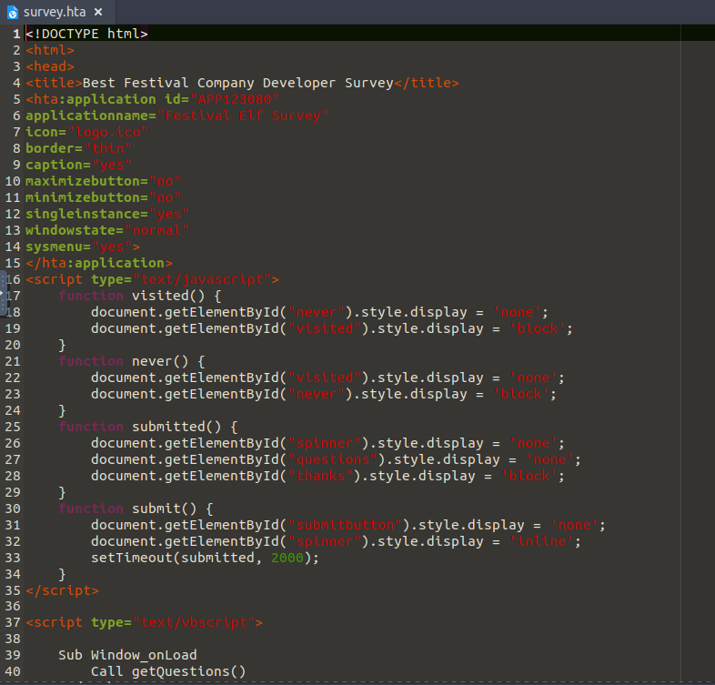
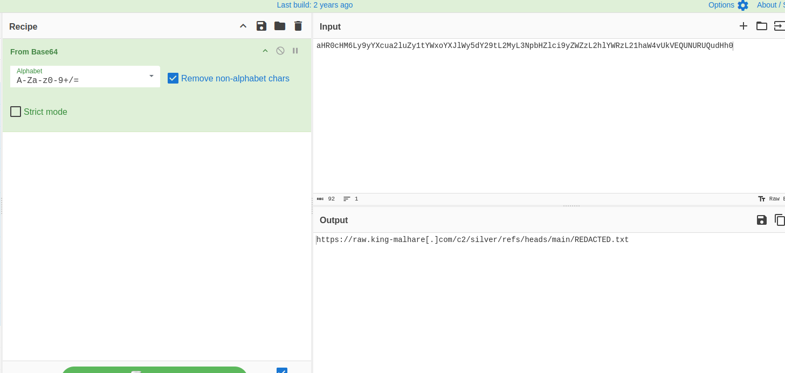
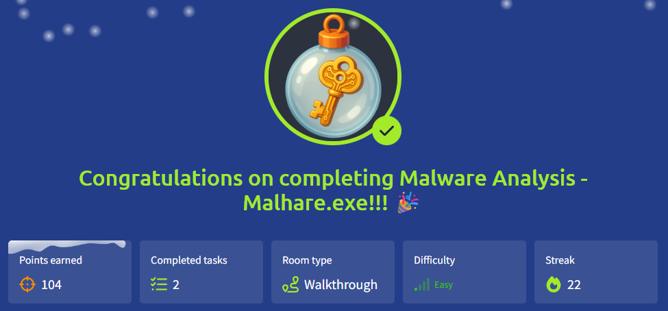

# 🎄Advent of Cyber 2025 – Day 21🎄
### Malware Analysis - Malhare.exe

---

## 🎯 Objective 

The goal of today’s task was to learn the basics of malware analysis by looking at a suspicious HTA file and understanding how attackers can abuse it to deliver malware.
The focus was on recognizing malicious behavior rather than fully reversing the malware.

---

## 🛠 Tools & Techniques Used

- Text editor (pluma) – to safely inspect the HTA file without executing it
- Static analysis – reading code instead of running it
- CyberChef – to decode Base64-encoded data
- Basic scripting knowledge (HTML / VBScript / PowerShell)
- Blue team mindset – looking for red flags and attacker behavior

---

## 🧠 What I Learned Today

- What HTA (HTML Application) files are and why they exist
- Why HTA files are commonly abused by attackers
- How attackers use VBScript + PowerShell to download and execute payloads
- Why Base64 encoding is often used to hide malicious commands
- How malware can execute entirely in memory to avoid detection
- What kind of indicators defenders should look for in suspicious scripts

---

## 📌 Step-by-Step Summary

**1.** Learned what a legitimate HTA file looks like and how it’s structured

**2.** Compared a normal HTA with a malicious HTA example

**3.** Identified suspicious elements like:
  - Hidden windows
  - Obfuscated code
  - PowerShell execution

**4.** Extracted a Base64-encoded string from the script

**5.** Decoded it using CyberChef to reveal a remote URL

**6.** Understood how the HTA:
  - Downloads content from the internet
  - Stores it in memory
  - Executes it without writing to disk

**7.** Opened the provided survey.hta safely using a text editor

**8.** Reviewed the script logic and function flow to understand its purpose
  
---

## 🔐 Key Cybersecurity Concepts

- HTA abuse – trusted Windows feature used for malware delivery
- Living-off-the-land (LOLBins) – using built-in tools like mshta.exe and PowerShell
- Obfuscation – hiding malicious intent using encoding
- In-memory execution – running malware without creating files
- Command and Control (C2) – malware reaching out to attacker-controlled servers
- Static analysis – inspecting malware without executing it

---

## 🖼️ Screenshots

*HTA file opened safely in a text editor to inspect metadata and embedded scripts.* ⬆️

*Decoding a Base64 string to reveal a hidden external resource.* ⬆️

*Proof of completing Day 5.* ⬆️

The screenshots above show the two most important steps in this analysis. First, the HTA file was opened safely in a text editor to inspect its structure and embedded scripts without executing it. This made it possible to identify script sections and understand how the file was intended to behave.
The second screenshot shows a Base64-encoded string being decoded, which revealed an external resource. This helped confirm that the HTA was attempting to download additional content, a common technique used in malware delivery. Together, these steps highlight how even a small HTA file can hide more complex and potentially malicious behavior.

---

## 🧭 Investigation Approach

I approached this task like a beginner SOC analyst. Instead of running the file, I opened it as plain text first to safely see what it contained. I looked for basic warning signs such as script sections, strange encoded strings, signs of network activity, and the use of PowerShell or system-related objects. When I found encoded data, I decoded it to understand what was being hidden. Rather than trying to understand every technical detail, I focused on the overall goal of the file and what the malware was trying to do.

---

## ✅ Final Takeaway

This day showed how small and harmless-looking files can hide serious threats.
HTA files are especially dangerous because they blend in as normal applications while having deep access to the system.
