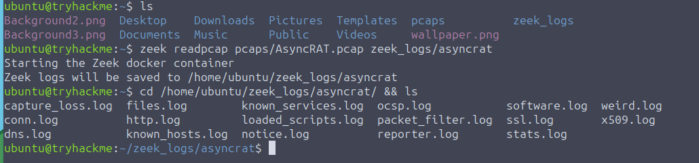
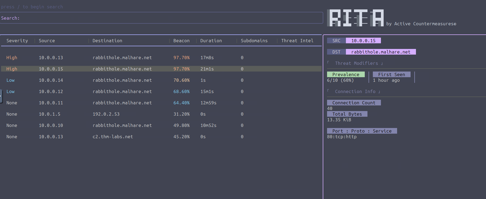
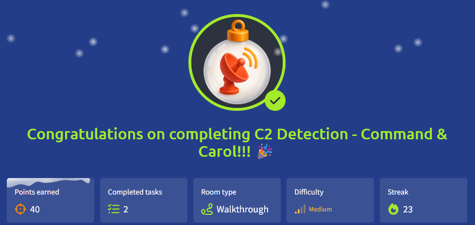

# 🎄Advent of Cyber 2025 – Day 22🎄
### C2 Detection - Command & Carol

---

## 🎯 Objective 

The goal of today’s task was to learn how command-and-control (C2) traffic can be detected by analyzing network data. The focus was on understanding how tools like Zeek and RITA help a SOC analyst identify suspicious connections inside large PCAP files.

---

## 🛠 Tools & Techniques Used

- Zeek – to convert raw PCAP traffic into structured logs
- RITA (Real Intelligence Threat Analytics) – to analyze Zeek logs and detect C2 patterns
- Terminal / CLI – to process and analyze network data
- PCAP analysis – working with captured network traffic
- Blue team analysis mindset – interpreting results instead of trusting scores blindly

---

## 🧠 What I Learned Today

- PCAP files are difficult to analyze directly and usually need to be converted into logs first
- Zeek turns raw packet data into readable, structured logs
- RITA looks for behavioral patterns, not malware signatures
- C2 traffic often shows patterns like:
  - Long-lived connections
  - Repeated beaconing
  - Unusual domains or IPs
- A low severity score does not automatically mean safe
- Analyst judgment is still required, even when using detection tools

---

## 📌 Step-by-Step Summary

I started by converting a provided PCAP file into Zeek logs using Zeek’s packet processing tools. This created multiple log files containing information about connections, DNS requests, SSL activity, and more.
Once the logs were ready, I imported them into RITA and let it analyze the dataset. RITA processed the logs and presented a structured view of connections, highlighting patterns that could indicate C2 behavior.
After viewing the results, I inspected individual connections to understand why they were flagged. This included checking connection duration, destination domains or IPs, ports, and threat modifiers. Rather than focusing only on severity scores, I looked at the overall behavior of each connection.
  
---

## 🔐 Key Cybersecurity Concepts

- Command and Control (C2): Communication between infected machines and attacker infrastructure
- Beaconing: Regular, repeated communication patterns often used by malware
- PCAP analysis: Investigating captured network traffic
- Behavior-based detection: Identifying threats based on patterns instead of signatures
- False positives: Legitimate traffic that may appear suspicious without enough context

---

## 🖼️ Screenshots

*Converting a PCAP file into Zeek logs for further analysis.* ⬆️

*RITA results showing multiple connections with varying severity levels and beacon scores.* ⬆️

In the RITA results, multiple internal hosts were observed communicating with the same external domain. Several of these connections showed high beacon scores and long connection durations, which are common indicators of command-and-control behavior. Even though not every entry was marked as high severity, the repeated pattern across multiple hosts suggests coordinated activity rather than normal traffic.

*Proof of completing Day 22.* ⬆️

---

## 🧭 Investigation Approach

I tried to approach this task like a beginner SOC analyst. I focused on understanding how the data was prepared before analysis and paid attention to what RITA highlighted as unusual. Instead of assuming every alert meant a confirmed threat, I looked at connection details such as duration, destination, and behavior over time. The goal was to understand why something looked suspicious, not just that a tool flagged it.

---

## ✅ Final Takeaway

This task showed that detecting C2 activity is not about finding one clear “malicious” sign, but about spotting patterns and context in network traffic. Tools like Zeek and RITA are powerful, but they don’t replace human analysis. Even with automated detection, a SOC analyst still needs to think critically and investigate further before drawing conclusions.
