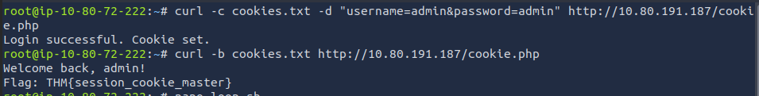
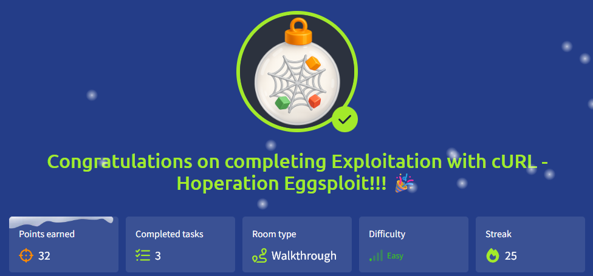

# 🎄Advent of Cyber 2025 – Day 24🎄
### Exploitation with cURL - Hoperation Eggsploit

---

## 🎯 Objective 

The goal of this task was to understand how web applications can be interacted with directly using curl, without a browser. By manually sending HTTP requests, the aim was to identify endpoints, handle authentication, manage sessions, and perform actions that would normally be done through a web interface.
Rather than relying on automated tools, this day focused on learning how web exploitation works at a lower level by crafting and replaying requests manually.

---

## 🛠 Tools & Techniques Used

- curl for sending HTTP GET and POST requests
- Basic understanding of HTTP methods and headers
- Handling cookies and sessions manually
- Simple scripting to automate repeated requests
- Inspecting server responses to guide next steps

---

## 🧠 What I Learned Today

This task helped me understand how much control curl gives when interacting with web applications. I learned that browsers don’t do anything “magical” — they just send HTTP requests, which can be recreated manually.
It also became clearer how login systems, cookies, and session handling work behind the scenes, and why weak authentication or poor validation can be dangerous if an attacker understands how requests are structured.

---

## 📌 Step-by-Step Summary

**1.** Sent basic HTTP GET requests using curl to view raw server responses.

**2.** Used POST requests to simulate form submissions such as login attempts.

**3.** Saved session cookies returned by the server and reused them in later requests.

**4.** Automated repeated login attempts using a simple loop to understand brute-force behavior.

**5.** Modified request headers (such as the User-Agent) to bypass basic server-side checks.

**6.** Identified important endpoints and understood how authenticated actions were performed.
  
---

## 🔐 Key Cybersecurity Concepts

- HTTP Methods: Understanding the difference between GET and POST requests.
- Sessions & Cookies: How servers track authenticated users.
- Brute Force Attacks: Why rate-limiting and strong authentication matter.
- Header-Based Controls: How weak checks (like User-Agent validation) can be bypassed.
- Manual Exploitation: Why knowing raw HTTP is important even when tools exist.

---

## 🖼️ Screenshots

*Sending a basic HTTP GET request with curl and viewing the raw server response.* ⬆️

*Submitting a POST request with curl that results in a successful login.* ⬆️

*Saving a session cookie after login and reusing it to access an authenticated endpoint.* ⬆️

 

*Proof of completing Day 24.* ⬆️

---

## 🧭 Investigation Approach

I approached this task methodically by first sending simple requests to understand how the server responded. From there, I gradually added more complexity, such as POST data, cookies, and headers. Instead of guessing, I focused on observing responses and adjusting requests based on what changed.
The goal was not to rush to the end, but to understand why each request worked and how the server interpreted it.

---

## ✅ Final Takeaway

This day showed how powerful simple tools like curl can be when you understand how web applications communicate. It reinforced that many attacks are not about advanced exploits, but about understanding protocols, logic, and trust assumptions made by developers.
Learning to manually craft and replay requests made the process feel much clearer and helped connect the theory of web attacks with how they actually happen in practice.
